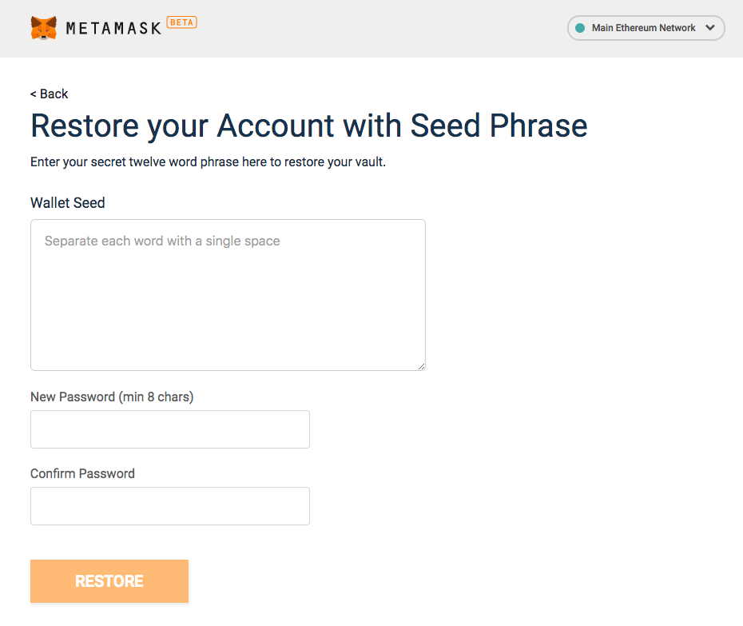
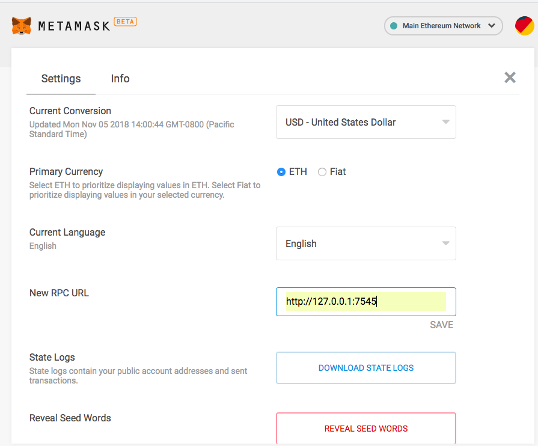
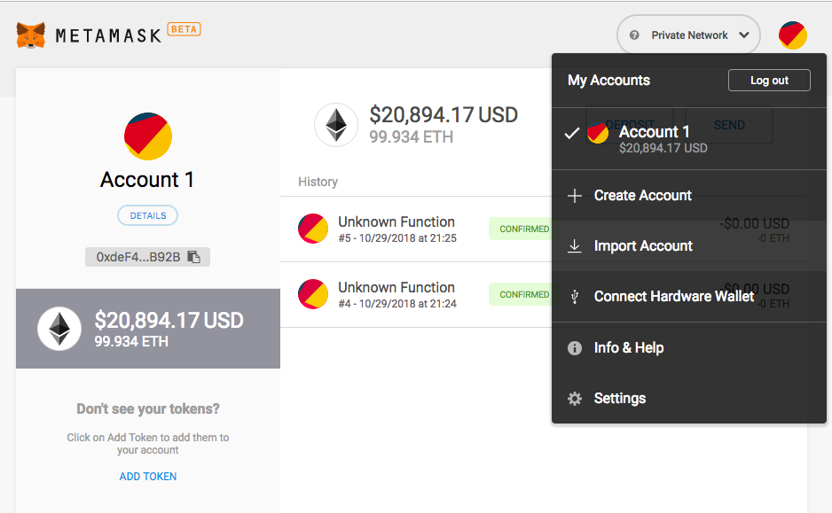
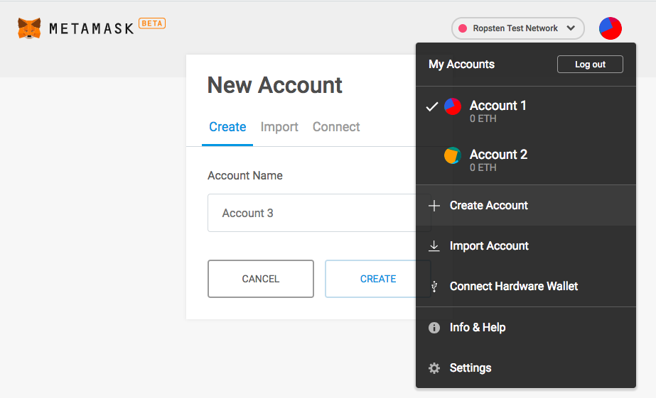

# Ethereum transactions using MetaMask
## Goal
In this activity, we will use the popular MetaMask Chrome browser extension to authorize  ETH transfers between Ethereum accounts using a lightweight **client-side** DApp, on both the local and public Ethereum blockchain.

## Exercise
This activity will require you to:
* Interact with MetaMask - a browser extension for accessing Ethereum based DApps 
* Use web3.js to interact between the blockchain network and a web front-end 
* Use HTML and JavaScript templates for a front-end web app
* Interact with the `Ropsten` Ethereum test network and record ETH transfers
* Use https://ropsten.etherscan.io/ to see the details of the transaction

## General activity notes
* Use the term 'App' going forward to mean 'DApps'
* If there are issues with correctly syncing MetaMask with the local blockchain and corresponding accounts, try to `Reset Account` under MetaMask settings
* This activity will use `lite-server`. Configuration for `lite-server` is set in `bs-config.json` so changes to the default PORT or browser can be set there.
* Of course one could just use MetaMask to send crypto between accounts but the purpose here is to demonstrate how a front-end app works with the `web3.js` library. 

### Setup
> In the `activity2/sample-app/` folder, run:
```
    npm install
```
This will install all the node dependencies for this basic front-end app. 

> Ensure you have Ganache running a local blockchain at `http://127.0.0.1:7545`.

> Download the MetaMask browser extension in Chrome (https://metamask.io/) if you have not already done so.

Now we will connect MetaMask with our local blockchain. 

> Open up the MetaMask extension and *Import using account seed phrase*. The phrase will be the mnemonic from Ganache. 



>Then from the list of networks, select `Custom RPC`. Here, set the *New RPC URL* to `http://127.0.0.1:7545`



>**Note:** While all 10 of your local Ganache blockchain accounts should load automatically, you may only end up with just the first account and you will have to add additonal accounts manually using the *Import Account* function.

   


### App setup
The `sample-app/` folder contains the boilerplate code for a very simple app. The front-end code, located in `src/` folder consists of HTML/CSS and JavaScript.

The focus for this part of the activity will be on the JavaScript code in `src/js/app.js`. 

Notice in our `package.json` that we have `lite-server` installed under the `dev` script, which will be used to run our sample app locally (https://github.com/johnpapa/lite-server). `lite-server` is built on BrowserSync so it serves the static content, detects changes, and refreshes the browser automatically.

Lite-server configuration is set in `bs-config.json`. You can customize the configuration to specify a different default port, browsers, server folders, etc..

> To get the sample app up and running using `lite-server`, run:
```
    npm run dev
```
> Now direct your browser to `http://localhost:3000` to see the App up and running!

### The index.html code
Key things to notice in our basic index.html are:
1. Our form which, on submit, triggers the `sendMoney()` function from `app.js`
2. There are 2 form fields: 1) Receiver Address and 2) amount in ETH
3. A paragraph HTML element with an id attribute of `accountAddress`. This is where the address of the current active account using the App will be presented.

### The app.js code
The starting code in `app.js` should look like this:
```
App = {
  web3Provider: null,

  init: function() {
    return App.initWeb3();
  },

  initWeb3: function() {
    if (typeof web3.currentProvider.selectedAddress !== 'undefined') {
      // If a web3 provider exists
      App.web3Provider = web3.currentProvider;
      web3 = new Web3(web3.currentProvider);
    } 
    else {
      // Specify default instance if no web3 provider
      App.web3Provider = new Web3.providers.HttpProvider('http://127.0.0.1:7545');
      web3 = new Web3(App.web3Provider);
    }
    return App.showActiveAccount();
  },

  showActiveAccount: function() {
    // TODO: Load account data - display active account info on the webpage
    
  },
  
  sendMoney: function() {
    //TODO: send money from active account to receiver

  },
};

$(function() {
  $(window).load(function() {
    App.init();
  });
});

```
The first thing to note is the `initWeb3` function which defines the web3 provider to be used by our app. When we launch MetaMask, it **injects an instance of Web3 into the app running in the browser**. If MetaMask is not active, the web3 provider will be by our local blockchain. 

For our simple app, we will:
1. Show the current active MetaMask account address on the webpage
2. Have a basic form with the receiver address and the amount of ETH to be transferred as inputs. 

### Show the current active MetaMask account on webpage
There are a few different ways to obtain the current active account. Recall how we obtained a list of active accounts by using the `web3.eth.getAccounts()` function in the first activity. When we use the web3 instance provided by our local blockchain, we get a list of all accounts because web3 has access to all of them. However, when we use MetaMask, the injected web3 instance only has access to the **active account**. 

Remember that the version of the web3 library used by MetaMask (i.e. the version of web3 in production) is the old 0.2x.x version with documentation here: https://github.com/ethereum/wiki/wiki/JavaScript-API#web3ethaccounts

The function takes in a callback with the result being the active MetaMask account address array (only 1 address in this array).

> Your `showActiveAccount()` function should look similar to the following:
```
showActiveAccount: function() {
  // Load account data - display your account info on the webpage
  web3.eth.getAccounts(function(err, accounts) {
    console.log(accounts);
    if (err === null) {
      App.account = accounts[0];
      $("#accountAddress").html("Your Account: " + accounts[0]);
    }
  });
},
```
Note: we store the active account `account[0]` in our `App` object with `App.account = accounts[0];` so that we can use this active address later if needed.

### The sendMoney function
The key feature of this app is to send a specified amount of ETH from the current address to a specified receiver. Recall how we did this at the end of Activity 1 by using the `web3.eth.sendTransaction({...})` function.  

> Your `sendMoney()` function should look similar to the following:
```
sendMoney: function() {
    const receiver = $('#receiver').val();
    const amount = $('#amount').val();

    web3.eth.sendTransaction({
        from: App.account,
        to: receiver,
        value: web3.toWei(amount, 'ether')
      }, function(err, txnHash) {
        if (!err) {
          console.log('txnHash is ' + txnHash);
        }
    });
},
```

> Question: In Activity 1, we converted the value to Wei using the function `web3.utils.toWei(..)`. Why are we using `web3.toWei(..)` here?

> Now go back to http://localhost:3000 where your app is running and try to send ETH to another address. What happens with MetaMask?

> Confirm that the funds have been sent by looking at the account balances in Ganache

**Congratulations!** You have successfully created a basic web app that uses the MetaMask browser extension to send ETH between 2 local accounts!

Now how do we do this with the public Ropsten Test Network?

### Using the Ropsten Test Network



> Open up MetaMask, change the network to `Ropsten Test Network` and create 2 accounts. We will be using these 2 accounts when sending ETH between them and recording the transaction on the public `Ropsten` network. 

> Send some test ETH to your Account1 address using https://faucet.metamask.io/ (make a few requests so that your Account1 has 2 or 3 Ether). Note it will take 20-30 seconds for each transfer to complete.


Recall the reason we need to do this is because any transaction recorded on the Ethereum blockchain requires a gas fee to complete the transaction. 

> Now run your app server again (if you stopped it) and browse to https://localhost:3000. Send some ETH between your accounts. 

> Verify the transaction both in your MetaMask wallet and on Etherscan (https://ropsten.etherscan.io/). Search for your transaction hash. What transaction details do you see?
