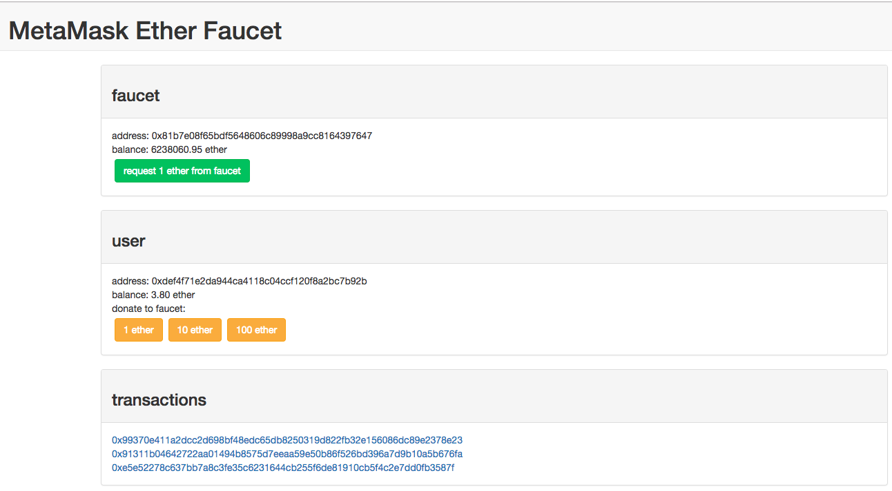
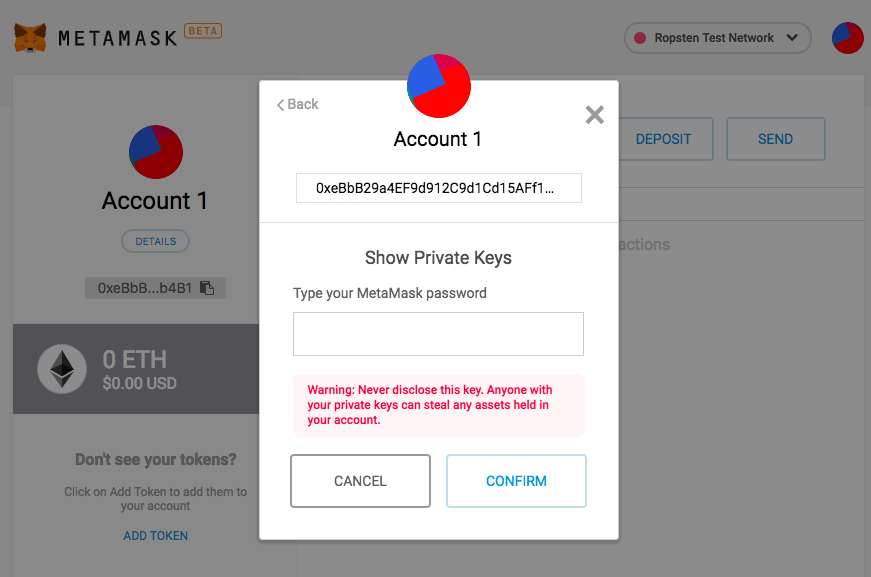

# Building, signing and broadcasting an Ethereum transaction
## Goal
In this stretch activity, we will build, sign and broadcast an ETH transfer transaction to a public test network. This is useful when you want to make transactions on the Ethereum blockchain **without** running your own Ethereum node or using a wallet or browser extension like MetaMask as we did before. This activity will give you a more detailed look at what is happening 'under-the-hood' when creating an Ethereum transaction. 

## Exercise
This activity will require you to:
* Use the specialized `ethereumjs-tx` library (https://github.com/ethereumjs/ethereumjs-tx/blob/master/docs/index.md) to create a transaction object.
* Interact with the `Ropsten` Ethereum test network using an Infura API key 
* Build, sign and broadcast an ETH transfer transaction on the `Ropsten` test network
* Validate that the transaction has been broadcasted publicly at https://ropsten.etherscan.io

### Setup
> You will need a couple of test accounts with test ETH. You can either use the MetaMask accounts or create your own locally by using web3 in Node. For example:
```
    > const Web3 = require('web3')
    > const web3 = new Web3("https://ropsten.infura.io/v3/<Your API Key>")
    > web3.eth.accounts.create()
{ address: '0x24D987cFeB1feD05fDD5187eCeE3AF15b7Baf708',
  privateKey:
   '0x2eaa2f9297813d3eac5fc137d27c11dba84afbfdbd42477eb311843ee76236f5',
  signTransaction: [Function: signTransaction],
  sign: [Function: sign],
  encrypt: [Function: encrypt] 
}
```

> As in the previos exercise, send some test ETH to your Account1 address using https://faucet.metamask.io/ (make a few requests so that your Account1 has 2 or 3 Ether). Note it will take 20-30 seconds for each transfer to complete.



> Copy the private keys of the first account. **Note: In general, you should not disclose your priviate key to anyone as it can be used to steal assets held in your acocunt~**



> And export them to local environment variables
```
    export PK_ACCOUNT_1='paste your account 1 private key'
```

> Install the `ethereumjs-tx` (https://github.com/ethereumjs/ethereumjs-tx) library
```
    npm install ethereumjs-tx
```

> Obtain your `Ropsten` test network API url in Infura. For example: `https://ropsten.infura.io/v3/182b941b70e6443b8854cc53786a3007`

> Create a file called `signedTransaction.js` and start by defining the following variables:
```
    const Tx = require('ethereumjs-tx')
    const Web3 = require('web3')
    const web3 = new Web3('your_ropsten_api_url')

    const account1 = 'public_address_of_account1'
    const account2 = 'public_address_of_account2'
```

### Buffers
The `Buffer` class is globally available within Node.js and is effectively a temporary store of binary data as it waits to be processed on a network. You can convert the binary data in the buffer into several different character encodings such as 'hex', 'ascii','utf8' and 'base64'.

For example:
```
    const buf = Buffer.from('hello world', 'ascii');
    
    // Prints: 68656c6c6f20776f726c64
    console.log(buf.toString('hex'));

    // Prints: aGVsbG8gd29ybGQ=
    console.log(buf.toString('base64'));
```
When using the `ethereumjs-tx` library, the `sign()` function takes a private key buffer as its input parameter. Hence, we will use Buffers to hold a binary copy of the private keys, which will then be used to sign our transaction.

> Add the following to `signedTransaction.js`:
```
    const privateKey1 = Buffer.from(process.env.PK_ACCOUNT_1, 'hex')
```

### Build the transaction
The transaction object looks similar to the object passed in the `web3.eth.sendTransaction()` function from activity1 but contains a few more details. For reference, see here: https://github.com/ethereumjs/ethereumjs-tx

```
    const txObject = {
        nonce: ,
        to: ,
        value: ,
        gasLimit: ,
        gasPrice: ,
    }
```
Let's look at each of these items (reference: https://github.com/ethereumjs/ethereumjs-tx/blob/master/docs/index.md):

1. `nonce` : This is a an arbitrary number used only once. Often, nonces will include a timestamp to help ensure they are used only once. We will use the `web3.eth.getTransactionCount()`  function result value of account1 as our nonce.
   
2. `to`: This is the receiving address/wallet
   
3. `value`: The amount to be sent in Wei
4. `gasLimit`: *Gas* on the ethereum network is the cost of executing a transaction. A *gas limit* limits how much gas is spent to execute code. If you set a value below the amount to run a particular code/operation, then you will see a 'Out of Gas' error. A common limit used during 'normal' times is 21,000.
5. `gasPrice`: The price per unit of gas in Wei. The higher this is, the more likely your transaction will be picked by miners to process. You can see current gas prices here: https://ethgasstation.info/. We will use a price of 10 Gwei. 

> Update the transaction object as follows. *Note all numerical values need to first be converted into hexadecimal*:
```
    const txObject = {
        nonce: web3.utils.toHex(txnCount),
        to: account2,
        value: web3.utils.toHex(web3.utils.toWei('1', 'ether')),
        gasLimit: web3.utils.toHex(21000),
        gasPrice: web3.utils.toHex(web3.utils.toWei('10', 'gwei'))
    }
```

The `txCount` value is obtained by calling the `web3.eth.getTransactionCount()` function on account1, and then passing this value as the callback function parameter. 
Putting this together looks like:
```
    web3.eth.getTransactionCount(account1, (err, txCount) => {
        // Build the transaction
        const txObject = {
            nonce: web3.utils.toHex(txCount),
            to: account2,
            value: web3.utils.toHex(web3.utils.toWei('0.5', 'ether')),
            gasLimit: web3.utils.toHex(21000),
            gasPrice: web3.utils.toHex(web3.utils.toWei('10', 'gwei'))
        }

        // TODO: Sign the transaction

        // TODO: Broadcast the transaction
    })
```
### Sign the transaction
>Following this as our reference (https://web3js.readthedocs.io/en/1.0/web3-eth.html#sendsignedtransaction) use account1 to sign the transaction with its buffered private key:
```
    const tx = new Tx(txObject)
    tx.sign(privateKey1)
```

> Print out the `tx` object in node so that we can get a sense of the complexity of the transaction data object.


We then need to serialize the signed transaction. We serialize data in order to store or transmit complex data forms in only one format that is easy to reconstruct later. 

> Call the `serialize()` function on the signed transaction.
```
    const serializedTx = tx.serialize()
```

> Finally, in order to use the `web3.eth.sendSignedTransaction()` function, we need to pass a string in HEX format of the *signed transaction data*. Thus we convert the `serializedTx` data object into a hex string and then prepend it with a '0x' so that the ethereum network clearly interprets it as a hexadecimal object. 
```
    const rawTx = '0x' + serializedTx.toString('hex')
```

>Your code should now look like:
```
    web3.eth.getTransactionCount(account1, (err, txCount) => {
        // Build the transaction
        const txObject = {
            nonce: web3.utils.toHex(txCount),
            to: account2,
            value: web3.utils.toHex(web3.utils.toWei('1', 'ether')),
            gasLimit: web3.utils.toHex(21000),
            gasPrice: web3.utils.toHex(web3.utils.toWei('10', 'gwei'))
        }

        // Sign the transaction
        const tx = new Tx(txObject)
        tx.sign(privateKey1)

        const serializedTx = tx.serialize()
        const rawTx = '0x' + serializedTx.toString('hex')

        // TODO: Broadcast the transaction
    })
```
### Broadcast the transaction to the Ethereum network
Lastly, to broadcast the transaction, we call the `web3.eth.sendSignedTransaction()` function and pass in the `rawTx` string. The response from this function call is a *transaction hash* - essentially an ID indicating the transaction has been broadcast on the network.

>Add the code to call the `sendSignedTransaction` function:
```
    web3.eth.sendSignedTransaction(rawTx, (err, txHash) => {
        console.log('txHash is: ', txHash)
    })
```
>Altogether, your `signedTransaction.js` should look like this:
```
    const Tx = require('ethereumjs-tx')
    const Web3 = require('web3')
    const web3 = new Web3('your_ropsten_api_url')

    const account1 = 'public_address_of_account1'
    const account2 = 'public_address_of_account2'

    const privateKey1 = Buffer.from(process.env.PK_ACCOUNT_1, 'hex')
    const privateKey2 = Buffer.from(process.env.PK_ACCOUNT_2, 'hex')

    web3.eth.getTransactionCount(account1, (err, txCount) => {
        // Build the transaction
        const txObject = {
            nonce: web3.utils.toHex(txCount),
            to: account2,
            value: web3.utils.toHex(web3.utils.toWei('0.5', 'ether')),
            gasLimit: web3.utils.toHex(21000),
            gasPrice: web3.utils.toHex(web3.utils.toWei('10', 'gwei'))
        }

        // Sign the transaction
        const tx = new Tx(txObject)
        tx.sign(privateKey1)

        const serializedTx = tx.serialize()
        const rawTx = '0x' + serializedTx.toString('hex')

        // Broadcast the transaction
        web3.eth.sendSignedTransaction(rawTx, (err, txHash) => {
            console.log('txHash is: ', txHash)
        })
    })
```
### Run your code
> From your Terminal, run `signedTransaction.js`:
```
    node signedTransaction.js
```

If your script runs correctly, you should see a transaction hash returned that looks something like:
```
    txHash is:  0x9f9f9a92a7eafdc7dada8a46fbe8ce709dc8af1b5ec9b2f926d19e615f77ac27
```

### See your transaction details on the public Ropsten network
> Go to `ropsten.etherscan.io` and copy your transaction hash in the search bar.

You should see your transaction details including the status, amount transferred, the 'from' and 'to' addresses, which should match the addresses used in your code.

> Go to your MetaMask wallet and see the account balances. Account 1 will be slightly less than 0.5 ETH because of the gas fees incurred to transfer the funds. Account 2 should have 0.5 ETH.


**Congratulations!** You have now built a transaction object from scratch, signed it using your private key, and broadcasted it to the network which was verified using Etherscan!


