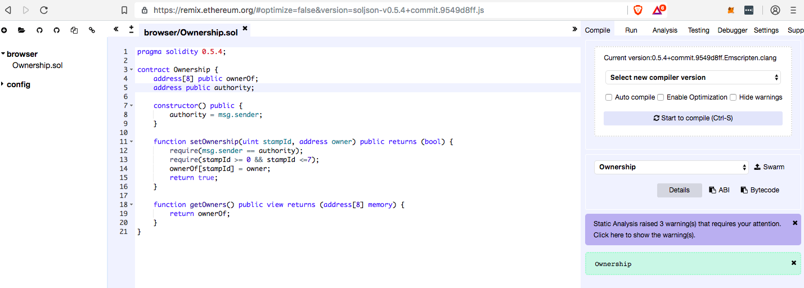
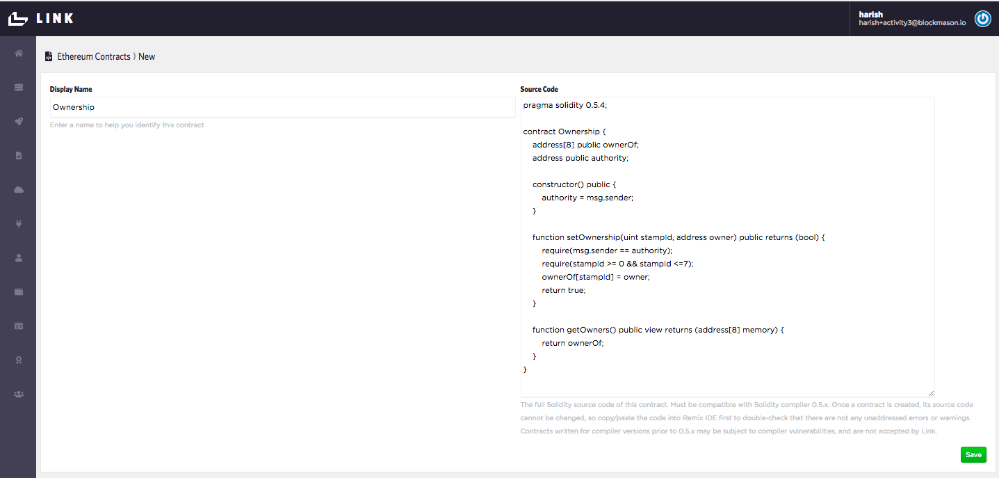
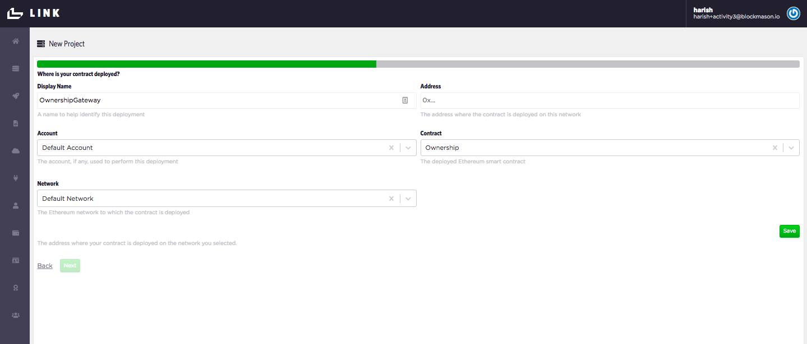
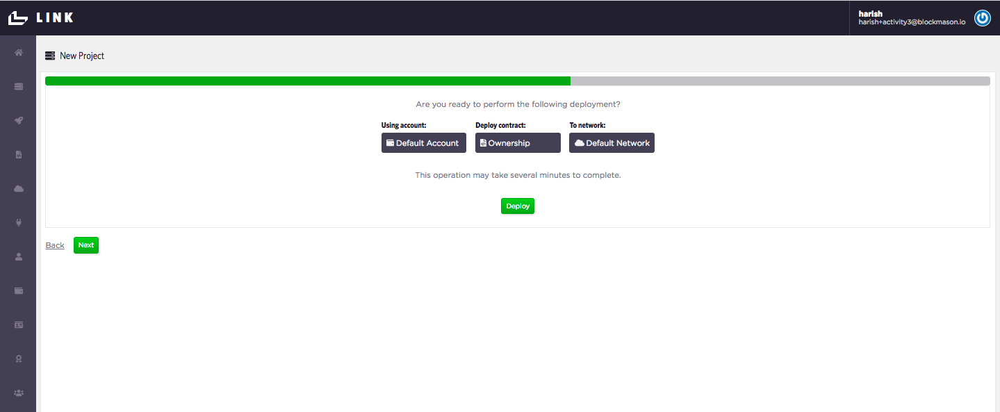
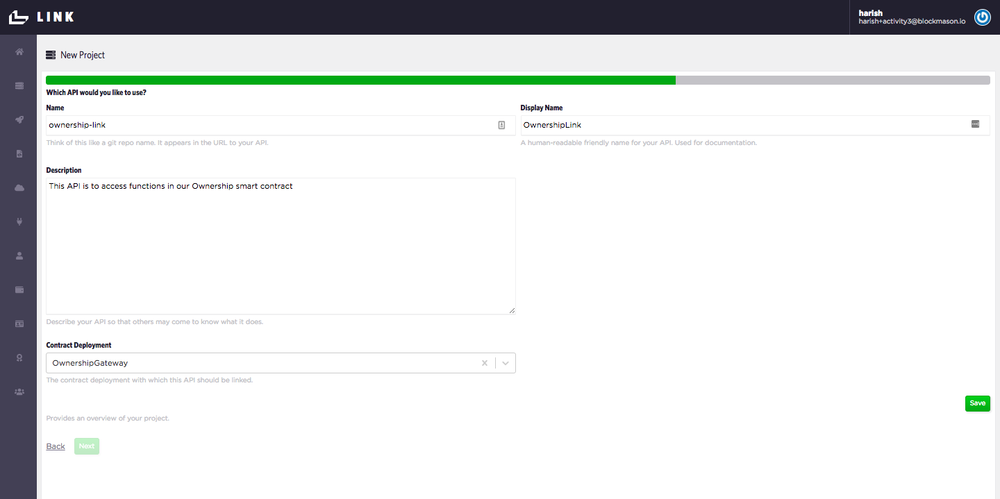
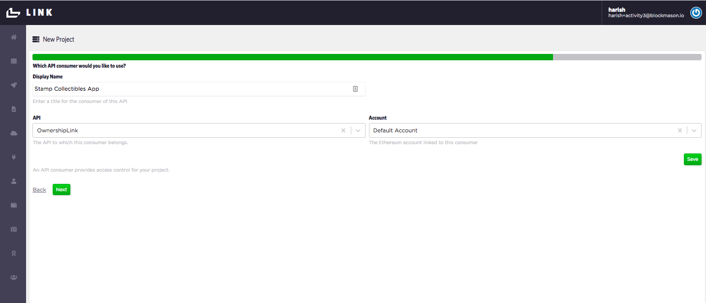
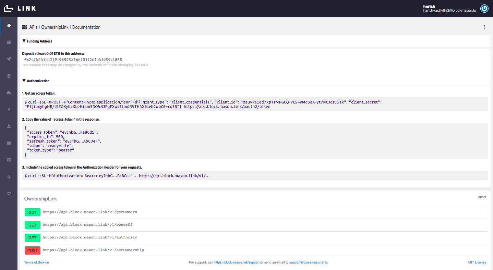

# Introduction to Smart Contracts and Blockmason Link
## Goal
In this activity, we will learn about Smart Contract design and use Link to deploy smart contracts and their create their corresponding APIs. 

## Exercise
This activity will require you to:
* Use Solidity (https://solidity.readthedocs.io/en/v0.5.4/) to create a basic 'Ownership' smart contract
* Use Remix (https://remix.ethereum.org) to test and validate the smart contract
* Use Link (https://mason.link) to deploy the smart contract to the Link private network
* Use Link to create smart contract APIs to be used by a web app. 

## General activity notes
* It is expected workshop participants have some familiarity with Solidity. This workshop will primarily cover 'types' of Solidity objects (https://solidity.readthedocs.io/en/v0.5.4/types.html)
* A dedicate `getOwners()` function is used instead of the automated getter that comes with the public declaration of the array variable `ownerOf` because the latter requires an array index to be passed to return a single value whereas the former will return the entire array.
* The Link private network is Link's own internal blockchain.

### Setup
> Ensure you have registered for a Link account at https://mason.link (email required)


### Smart Contract Design
* The types of Solidity objects, in particular:
  * `uint`, `string`, `address` & `address payable`, `msg.sender`
  * Mapping vs. Array
  * Struts
  * `public` keyword and getters
* `require` keyword
* `memory` vs `storage`
* Security Considerations
  * Private information and randomness
  * Re-entrancy
  * Checks-Effects-Interactions pattern
  * Underflows / Overflows
  * Take compiler warnings seriously!
* Use of an 'authority' to sign off on transactions

### Create 'Ownership' Smart Contract
> Copy the following smart contract code into the Remix browser IDE for this part of the exericse.

The skeleton of the Ownership contract is:
```
pragma solidity 0.5.4;

contract Ownership {
	// Add some state variables

    constructor() public {
        // Default constructor
    }

    function setOwnership(uint stampId, address owner) public returns (bool) {
        // Set ownership
    }

    function getOwners() public view returns (address[8] memory) {
        // Return owners array
    }
}
```

First, we want to access the list of owners for a type of asset, say collector stamps. The array index will refer to the asset identifier and the value will be the owner's wallet address. For this example, assume only 8 assets will be owned. 

> Add the public `ownerOf` state variable and return it in the `getOwners()` function.
```
pragma solidity 0.5.4;

contract Ownership {
    address[8] public ownerOf;

    constructor() public {
        // Default constructor
    }

    function setOwnership(<pass some arguments here>) public returns (bool) {
        // Set ownership
        return true;
    }

    function getOwners() public view returns (address[8] memory) {
		return ownerOf;
    }
}
```
Note - the `address[8]` defines an array of length 8 of type `address`. The `public` keyword makes it externally accessible through an automatically created getter. However, one cannot retrieve the entire array at once but rather must pass an index value to retrieve a single value (e.g. call `ownerOf(1)`). 

To get around this getter limitation, we create a `getOwners()` function and specify the return value to be of type `address[8]`. This allows us to return the entire `ownerOf` array. 

> Next, let's complete the `setOwnership(...)` function. We want to assign a particular stamp ID to an owner address. Additionally, we want to check that the stamp ID is within the array size limits. 
```
function setOwnership(uint stampId, address owner) public returns (bool) {
        require(stampId >= 0 && stampId <=7);
        ownerOf[stampId] = owner;
        return true;
    }
```

> Lastly, we want to set an 'authority' address that initially creates the smart contract and also calls and executes the smart contract functions. For testing in this exercise, we also want to make this authority address publicly available.
```
pragma solidity 0.5.4;

contract Ownership {
    address[8] public ownerOf;
    address public authority;

    constructor() public {
        authority = msg.sender;
    }

    function setOwnership(uint stampId, address owner) public returns (bool) {
        require(msg.sender == authority);
        require(stampId >= 0 && stampId <=7);
        ownerOf[stampId] = owner;
        return true;
    }

    function getOwners() public view returns (address[8] memory) {
        return ownerOf;
    }
}
```
> Check that you can compile this contract in Remix without errors. 
> 


### Deploy Ownership contract to Link Testnet and Create API Project
We're now going to deploy our Ownership smart contract to a blockchain using Link. 

> Log into Link and setup a sample organization if you haven't done so already. Use the wizard on the Dashboard to create a new project.

> Copy and paste the Solidity code into the area marked `Source Code` and set the display name to `Ownership`. **Check that the code spacing is correct after the copy/paste.** Press `Save`. 



> Then, use the `Default Account` Ethereum account, which is automatically set up. 

> Use the `Default Network` which is the Link private network.

> Use the `Default Network` connector/gateway, which is how Link connects to the network that will store the Ownership contract. 

> Next, we need to deploy the Ownership contract to the Default Network. We'll call this deployment `OwnershipGateway`. Keep the `Address` field empty. 



> Confirm and deploy your contract. 



Since this is done on the Link private network, the deployment should happen in seconds. When we do this again with the Ethereum public testnet, it'll take about 30-60 seconds. 

> With your contract now deployed, let's create our API project called `ownership-link`, which will access our Ownership smart contract:



> Then we create an API consumer which will be using our `ownership-link` APIs. Think of this as the front-end app using the APIs. We'll call this consumer `Collectible Stamps App`. 



> Finally, we'll use the default generated OAuth 2.0 client secret for our `Collectible Stamps App`. This is how the Stamp App will be allowed to use the `ownership-link` APIs.

You should now see the 'OwnershipLink' documentation as follows:



**Congrats! You have successfully deployed the Ownership contract to the Link private network and setup the Link APIs which we'll use in our Collectible Stamps App!**
 