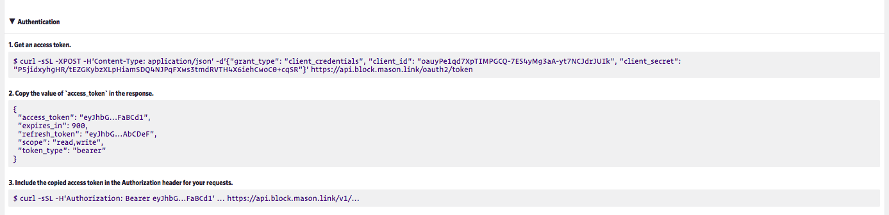
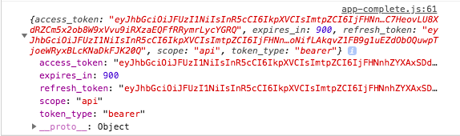

# Create your web DApp using Link (i.e. the 'easy' way)
## Goal
In this activity, we will create a web application and use the Link APIs generated in the previous activity to interact with the blockchain. 

## Exercise
This activity will require you to:
* Use HTML and JavaScript templates for a front-end web app that interacts with the Link smart contract APIs.
* Chrome's browser console is used to test and troubleshoot the Link APIs in this exercise. 

## General activity notes
* This exercise uses JavaScript Promises to handle Link API responses via the native async/await syntax. 
* This exercise also uses web3 for continuity from activity 2 and also to use different wallet address via MetaMask. 

### Setup
> In the `activity4/collectible-stamps-app/` folder, run:
```
    npm install
```
This will install all the node dependencies for this basic front-end app.

> Then, get the app up and running using `lite-server` (like in activity 2), with:
```
    npm run dev
```
> Now direct your browser to `http://localhost:3000` to see the skeleton App up and running.

> Open up Chrome Developer Tools and select the `Console`

### The Collectible Stamps App
Taking a look inside the `activity4/collectible-stamps-app/` folder, we see that the structure represents a very basic javascript app:
* A `src/` containing the `index.html`, `css/` and `js/` folders with corresponding script files. There's also a `stamps.json` which will be the data source for our app. 
  
* The `bs-config.json` is the config file for our `lite-server`. Here, you can set parameters such as the project base directory, server port, source files. See https://www.npmjs.com/package/lite-server#custom-configuration for more info. 

* The `index.html` is a single container where stamps get displayed and also incorporates bootstrap for styling. 

Let's start building out our `app.js`.

#### Fetch Access Token
The skeleton of `app.js` looks as follows:
```
App = {
  clientId: "",
  clientSecret: "",
  authURL: 'https://api.block.mason.link/oauth2/token',
  baseURL: "",
  web3Provider: null,

  init: function() {
    // Load stamps.
    $.getJSON('../stamps.json', function(data) {
      const stampsRow = $('#stampsRow');
      const stampTemplate = $('#stampTemplate');

      for (i = 0; i < data.length; i ++) {
        stampTemplate.find('.panel-title').text(data[i].name);
        stampTemplate.find('img').attr('src', data[i].picture);
        stampTemplate.find('.stamp-fact').text(data[i].fact);
        stampTemplate.find('.btn-own').attr('data-id', data[i].id);

        stampsRow.append(stampTemplate.html());
      }
      return App.markOwned();
    });
    return App.initWeb3();
  },

  initWeb3: function() {
    if (typeof web3.currentProvider.selectedAddress !== 'undefined') {
      App.web3Provider = web3.currentProvider;
    } else {
      // If no injected web3 instance is detected, fall back to Ganache
      App.web3Provider = new Web3.providers.HttpProvider('http://localhost:7545');
    }
    web3 = new Web3(App.web3Provider);

    return App.bindEvents();
  },

  bindEvents: function() {
    $(document).on('click', '.btn-own', App.handleOwn);
  },

  accessToken: async function() {
    //fetch auth token from Link
  },
  
  markOwned: async function() {
    // Identify owners of stamps
  },
  
  fetchActiveAccount: async function() {
    // Same as in activity 2
  },
  
  handleOwn: async function(event) {
    event.preventDefault();
    // Assign ownership of stamps
  }
};

$(function() {
  $(window).load(function() {
    App.init();
  });
});
```
Starting from the bottom with the window loading, `App.init()` is called which loads all the stamp data into the `index.html`. 

The `initWeb3()` function is the same as in activity 2. 

We'll start by completing the `accessToken()` function first. From Link, we have:



Note that the access token expires every 15 mins (900 seconds). Hence, we should make a POST request using the `client_credentials` everytime we want to use a Link API. 

> First create the POST request body using the key/value pairs shown in the Link `curl` example:
```
accessToken: async function() {
  const authBody = {
    "grant_type": "client_credentials",
    "client_id": App.clientId,
    "client_secret": App.clientSecret
  }
},
```

> Then using the fetch API, make the POST request to obtain a token. Remember to convert the body into a JSON string. 
```
accessToken: async function() {
  const authBody = {
    "grant_type": "client_credentials",
    "client_id": App.clientId,
    "client_secret": App.clientSecret
  }

  const tokenResponse = await fetch(App.authURL, {
    method: "post",
    headers: {
        "Content-Type": "application/json",
    },
    body: JSON.stringify(authBody),
  });
},
```

> Then extract the `tokenResponse` JSON and return the `"access_token"` value:
```
accessToken: async function() {
  const authBody = {
    "grant_type": "client_credentials",
    "client_id": App.clientId,
    "client_secret": App.clientSecret
  }

  const tokenResponse = await fetch(App.authURL, {
    method: "post",
    headers: {
        "Content-Type": "application/json",
    },
    body: JSON.stringify(authBody),
  });
  
  const tokenData = await tokenResponse.json();
  console.log(tokenData);
  return tokenData["access_token"];
},
```
> Finally, add your `client_id` and `client_secret` from Link to the `App.clientId` and `App.clientSecret` attributes respectively at the top. Then call the `App.accessToken()` function from within the `markeOwned` function definition to trigger it. 

In your browser console, you should see something similar to the following which is the access token response object. 



Now we just have to fetch and pass this access_token as a bearer token when we make our Link API requests. 

#### Mark Ownership
The way our app will mark ownership is by first retrieving the `ownerOf` array from the blockchain and then for each stamp, appending the owner's address in the stamp panel footer, if an owner exists (i.e. the wallet address is not `0x000...`).

> First, we fetch the access token and then from Link, we see that we can make a GET request to the `getOwners` endpoint to access that smart contract variable. 

```
markOwned: async function() {
  const token = await App.accessToken();
  const url = App.baseURL.concat('getOwners');
},
```
The `App.baseURL`attribute is set at the top and will be `https://api.block.mason.link/v1/` . 

> Then, fetch and console.log the `ownerOf` array object. 
```
markOwned: async function() {
  const token = await App.accessToken();
  const url = App.baseURL.concat('getOwners');
  const response = await fetch(url, {
    method: "get",
    headers: { 
      "Content-Type": "application/json",
      "Authorization": "Bearer " + token 
    },
  });

  const data = await response.json();
  console.log('owners object is', data);

},
```
We can see that the response object from Link has a `"result"` key by default which gives the owners array object. We then iterate over this array and if the owner at each array index is not the `0x000...` address, we:

1. Disable the 'Own' button on each stamp
2. Ensure the #ownerAddress html paragraph element is empty
3. Append the owner's address to the #ownerAddress element

```
markOwned: async function() {
  const token = await App.accessToken();
  const url = App.baseURL.concat('getOwners');
  const response = await fetch(url, {
    method: "get",
    headers: { 
      "Content-Type": "application/json",
      "Authorization": "Bearer " + token 
    },
  });

  const data = await response.json();
  console.log('owners object is', data);

  const owners = data.result;
  
  for (i = 0; i < owners.length; i++) {
    if (owners[i] !== '0x0000000000000000000000000000000000000000') {
      $('.panel-stamp').eq(i).find('.btn-own').text("Own").attr('disabled', true);
      $('.panel-stamp').eq(i).find('#ownerAddress').empty();
      $('.panel-stamp').eq(i).find('#ownerAddress').append('Owner: ' + owners[i]).css({ wordWrap: "break-word" });    
    }
  }
},
```
#### Handle Ownership
The way our app will set ownership is by posting the stamp ID and an address to the `setOwnership` API endpoint of the Ownership smart contract. Note we've setup a 'click' event listener in our `bindEvents` function:
```
bindEvents: function() {
  $(document).on('click', '.btn-own', App.handleOwn);
},
```

> To get the active address, we can use the web3.js function as we did in the `showActiveAccount()` function from activity 2 (https://github.com/ethereum/wiki/wiki/JavaScript-API#web3ethaccounts): 

```
fetchActiveAccount: async function() {
  const accounts = await web3.eth.accounts;
  return accounts[0];
},
```

> Then, in our `handleOwn` function, we fetch the active account, and if one exists, obtain the relevant stamp data:
```
handleOwn: async function(event) {
  event.preventDefault();

  const account = await App.fetchActiveAccount();
  
  if (account) {
    const stampId = parseInt($(event.target).data('id'));
    $('.panel-stamp').eq(stampId).find('.btn-own').text("Processing").attr('disabled', true);

    console.log('account is', account);
    
    // Make POST request
  } 
  else {
    alert("Ensure you have logged into your Metamask wallet to own this stamp ");
  }
}
```
> Next, we fetch an access token and make our POST request using a try/catch statement:

```
handleOwn: async function(event) {
  event.preventDefault();

  const account = await App.fetchActiveAccount();
  
  if (account) {
    const stampId = parseInt($(event.target).data('id'));
    $('.panel-stamp').eq(stampId).find('.btn-own').text("Processing").attr('disabled', true);

    
    console.log('account is', account);
    const token = await App.accessToken();
    const url = App.baseURL.concat('setOwnership');
    
    const reqBody = {
      "stampId": stampId,
      "owner": account
    };

    try {
      const response = await fetch(url, {
        method: "post",
        headers: { 
          "Content-Type": "application/json",
          "Authorization": "Bearer " + token,
        },
        body: JSON.stringify(reqBody),
      });
      const data = await response.json();

    } catch(err) {
        console.log(err);
    }
  } 
  else {
    alert("Ensure you have logged into your Metamask wallet to own this stamp ");
  }
}

```
> Finally, if the response object indicates success, we update ownership by running the `markOwned()` function. Otherwise, we just reactivate the `Own` button. 

```
handleOwn: async function(event) {
  event.preventDefault();

  const account = await App.fetchActiveAccount();
  
  if (account) {
    const stampId = parseInt($(event.target).data('id'));
    $('.panel-stamp').eq(stampId).find('.btn-own').text("Processing").attr('disabled', true);

    
    console.log('account is', account);
    const token = await App.accessToken();
    const url = App.baseURL.concat('setOwnership');
    

    const reqBody = {
      "stampId": stampId,
      "owner": account
    };

    try {
      const response = await fetch(url, {
        method: "post",
        headers: { 
          "Content-Type": "application/json",
          "Authorization": "Bearer " + token,
        },
        body: JSON.stringify(reqBody),
      });
      const data = await response.json();
      
      if (data.success) {
        App.markOwned();
      } 
      else {
        $('.panel-stamp').eq(stampId).find('.btn-own').text("Own").attr('disabled', false);
      }

    } catch(err) {
        console.log(err);
    }
  } 
  else {
    alert("Ensure you have logged into your Metamask wallet to own this stamp ");
  }
}
```
That's it! Give your app a try and see how it all works together. The full code is in `app-complete.js`. 

### Stretch Exercise - Use Ethereum's Ropsten Testnet
> As a stretch exercise, first deploy your `Ownership` contract to Ethereum's Ropsten testnet. You will need to use Infura for your network connector/gateway and fund your Link account with some test Ether (ETH) Go through the Link wizard at https://mason.link/projects/new to create a 'Ropsten' network object and an 'Infura' Network Connector. Then deploy your contract on that network.

> Once deployed, create a new API that uses this Ropsten deployed contract.

> Finally, update your `Collectible Stamps App` consumer to use the new API and now your App is configured with the public Ropsten testnet! Note: while transactions to the Link testnet take just a few seconds, transactions with the Ropsten testnet can take anywhere from 30-60 seconds. 


