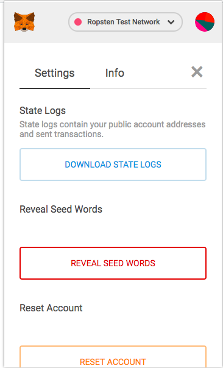
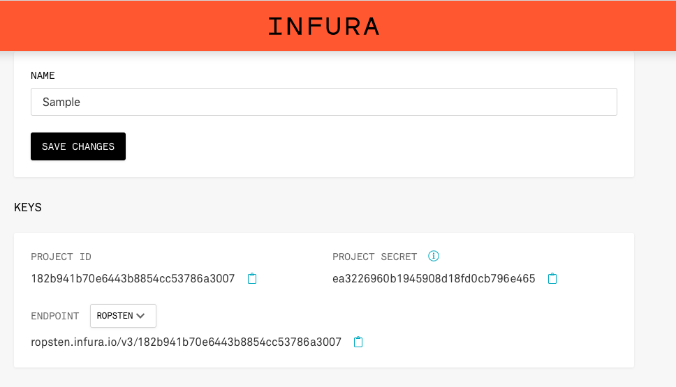
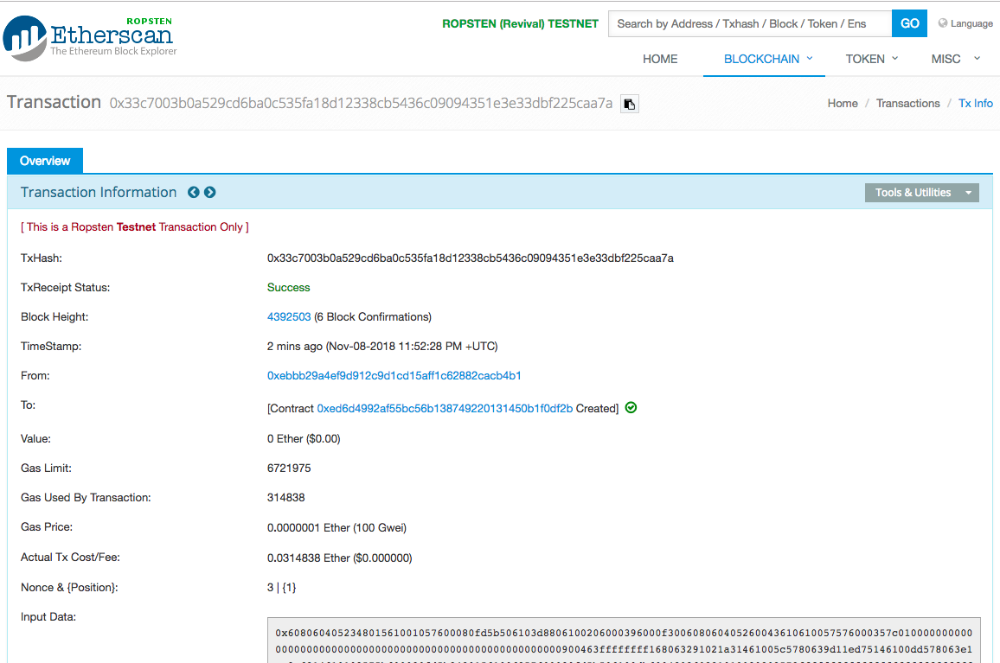

# Create your web DApp using Truffle (i.e. the 'hard' way)
## Goal
In this activity, we will use the popular Truffle development framework to re-create our Collectible Stamps App from the previous exercise. We will then compare and contrast the two approaches.

The goal after this activity is to have an appreciation of all the steps in the blockchain app development process that are done 'behind the scenes' by Link. 

## Exercise
This activity will require you to:
* Use Truffle - a popular environment and framework for blockchain development
* Use Truffle's `HDWalletProvider` and Infura (https://infura.io) to deploy your smart contract to the public `Ropsten` test network
* Use web3.js for our app to interact with both a local and public blockchain
* Use HTML and JavaScript for the front-end web app, similar to the previous activity

We will first deploy and run the App using our local blockchain and then the public `Ropsten` test network. Much of the truffle code used to do this is boilerplate code. 

### Setup

> In the `activity5/collectible-stamps-app/` folder, run:
```
    npm install
```
This will install all the node dependencies - have a look in `package.json` to see what those dependencies are. 

> Ensure you have Ganache running a local blockchain at `http://127.0.0.1:7545`.

A truffle project contains the following key folders/files:
* `contracts/` which contain the Solidity smart contract files (`.sol` extension). By default, when you create a truffle project, the `Migrations.sol` contract is created by default.
  
* `migrations/` which contain JavaScript files that deploy the contracts to the blockchain (think of these as database migration scripts). The `1_inital_migration.js` file is always used and run first by default. Additional migration files will be labled following the convention `2_<deploy stuff>`, etc..

* `truffle.js`. This is the config file telling Truffle which blockchain networks are setup and how to connect with them. For development, we are using a local blockchain with Ganache on `http://127.0.0.1:7545`. To connect with the public Ropsten testnet, we are using a package called `truffle-hdwalle-provider` to connect to a public Ethereum address using Infura as the network connector/gateway.

### Create and Deploy the Ownership Smart Contract
In activity 3, we used Link to create and deploy the `Ownership` smart contract. Here is what the process is to do so using Truffle. 

> Copy and paste the Solidity `Ownership` contract code into a `Ownership.sol` that is stored in the `contracts/` folder. The filename should match the contract name. 

> Copy and adapt the code in the default `1_initial_migration.js` file to deploy the `Ownership` smart contract. Call this file `2_deploy_ownership.js` with the following contents:
```
const Ownership = artifacts.require("./Ownership.sol");

module.exports = function(deployer) {
    deployer.deploy(Ownership);
};
```
> Now to compile the `Ownership` smart contract to our local blockchain, run the following from the Terminal:
```
truffle compile
```
This will compile and build your contract artifacts in a folder called `build/`.

>Then to deploy the contracts on the local blockchain, run:
```
truffle migrate --network development
```
You should see each contract deployed with a hash address in your Terminal output. 

In addition, you should also see the first account in Ganache have slightly less than 100 ETH as a small amount of ETH was used as a **gas fee to transact with the local network**.

So we have now created our `Ownership` smart contract and deployed it to our local blockchain.

### Front-end setup with MetaMask
In order to interact with our Lending smart contract, we will work with a basic front-end consisting of HTML/CSS and JavaScript. We will use Bootstrap for our CSS. Our front-end files are stored in the `src/` folder.

The focus for this part of the activity will be on the JavaScript code in `src/js/app.js`. 

> To get the Collectible Stamps App up and running using `lite-server`, as before, run:
```
    npm run dev
```
> Now direct your browser to `http://localhost:3000` where you should see the collectible stamps load. Ensure you have logged into MetaMask.

#### Configure app.js
The scaffolding code for our `app.js` should look familiar:
```
App = {
  web3Provider: null,
  contracts: {},

  init: function() {
    // Load stamps.
    $.getJSON('../stamps.json', function(data) {
      const stampsRow = $('#stampsRow');
      const stampTemplate = $('#stampTemplate');

      for (i = 0; i < data.length; i ++) {
        stampTemplate.find('.panel-title').text(data[i].name);
        stampTemplate.find('img').attr('src', data[i].picture);
        stampTemplate.find('.stamp-fact').text(data[i].fact);
        stampTemplate.find('.btn-own').attr('data-id', data[i].id);

        stampsRow.append(stampTemplate.html());
      }
    });

    return App.initWeb3();
  },

  initWeb3: function() {
    if (typeof web3.currentProvider.selectedAddress !== 'undefined') {
      App.web3Provider = web3.currentProvider;
    } else {
      // If no injected web3 instance is detected, fall back to Ganache
      App.web3Provider = new Web3.providers.HttpProvider('http://localhost:7545');
    }
    web3 = new Web3(App.web3Provider);

    return App.initContract();
  },

  initContract: function() {
    $.getJSON('Ownership.json', function(data) {
     // Get the necessary contract artifact file and instantiate it with truffle-contract
     const OwnershipArtifact = data;
     App.contracts.Ownership = TruffleContract(OwnershipArtifact);

     // Set the provider for our contract
     App.contracts.Ownership.setProvider(App.web3Provider);

     // Use our contract to retrieve and mark the adopted pets
     return App.markOwned();
    });

    return App.bindEvents();
  },

  bindEvents: function() {
    $(document).on('click', '.btn-own', App.handleOwn);

  },

  markOwned: function() {
    //Mark stamp ownership
  },
  
  fetchActiveAccount: async function() {
    const accounts = await web3.eth.accounts;
    return accounts[0];
  },
  
  handleOwn: async function(event) {
    event.preventDefault();
    // Assign ownership of stamps
  },
};

$(function() {
  $(window).load(function() {
    App.init();
  });
});
```
A key difference here is the `initContract()` function which is where the `truffle-contract` library is used to create an Ethereum contract interface via the `TruffleContract` object:
```
App.contracts.Ownership = TruffleContract(OwnershipArtifact);
```
For more info on `truffle-contract` and how it works, see the documentation here: https://github.com/trufflesuite/truffle/tree/develop/packages/truffle-contract#truffle-contract

#### Mark Ownership
The way our app will mark ownership is by first retrieving the `ownerOf` array from the blockchain and then for each stamp, appending the owner's address in the stamp panel footer, if an owner exists (i.e. the wallet address is not `0x000...`).

To access the `ownerOf` contract variable using `truffle-contract`, first we need to create an instance of the `Ownership` contract by calling the `deployed()` function and then call the `getOwners()` function from that instance. Here's some temp code that explains how this works, again from the `truffle-contract` documentation:
```
var deployed;
MyContract.deployed().then(function(instance) {
  deployed = instance;
  return instance.someFunction();
}).then(function(result) {
  // Do something with the result or continue with more transactions.
});

OR

const deployed = await MyContract.deployed();
const result = await instance.someFunction(); 

```
So our `markOwned` function will look something like this:

```
markOwned: async function() {
  const ownershipInstance = await App.contracts.Ownership.deployed();
  const owners = await ownershipInstance.getOwners();

  for (i = 0; i < owners.length; i++) {
    if (owners[i] !== '0x0000000000000000000000000000000000000000') {
      $('.panel-stamp').eq(i).find('.btn-own').text("Own").attr('disabled', true);
      $('.panel-stamp').eq(i).find('#ownerAddress').empty();
      $('.panel-stamp').eq(i).find('#ownerAddress').append('Owner: ' + owners[i]).css({ wordWrap: "break-word" });
    }
  }
},
```
#### Handle Ownership
The way our app will set ownership is by posting the stamp ID and an address to the `setOwnership` function. Recall that we've setup a 'click' event listener in our `bindEvents` function:
```
bindEvents: function() {
  $(document).on('click', '.btn-own', App.handleOwn);
},
```

The code is similar to what we used in activity 4 but again we have to create a contract instance to use as above. So our `handleOwn` function will look something like this:
```
handleOwn: async function(event) {
  event.preventDefault();

  const stampId = parseInt($(event.target).data('id'));
  $('.panel-stamp').eq(stampId).find('.btn-own').text("Processing").attr('disabled', true);
  
  const account = await App.fetchActiveAccount();

  if (account) {
    const ownershipInstance = await App.contracts.Ownership.deployed();
    try {
      const result = await ownershipInstance.setOwnership(stampId, {from: account});
      console.log('transaction result is', result);
      setTimeout(function() {
          App.markOwned();
          }, 5000);
    } catch(err) {
        console.log(err);
        $('.panel-stamp').eq(stampId).find('.btn-own').text("Own").attr('disabled', false);
    }
  } else {
      alert("Ensure you have logged into your Metamask wallet to own this stamp ");
  }
},
```
The reason for the 5 second delay with the `setTimeout` function call before we refresh the ownership display is because there is a delay between the transaction getting posted on the public blockchain and when the transaction is confirmed. The `transaction result` object gives an ID of the posted transaction. MetaMask will then shortly thereafter provide a confirmation alert.

### Stretch Exercise - Use Ethereum's Ropsten Testnet
Now that we've run our Collectible Stamps App using our local blockchain, let's deploy and run using the public Ropsten testnet. 

> In your Terminal, create an environment variable for your account's mnenomic that you get from your Rosten MetaMask account. **Note** - you can find the mnenomic from your account Settings -> Reveal Seed Words.



Then run the following:

```
    export MNEMONIC='<your account mnemonic>'
```

> Your Ropsten network definition in `truffle.js` will look something like this:
```
var HDWalletProvider = require("truffle-hdwallet-provider");
var mnemonic = process.env.MNEMONIC;

module.exports = {
  // See <http://truffleframework.com/docs/advanced/configuration>
  // for more about customizing your Truffle configuration!
  networks: {
    development: {
      ...
    },
    ropsten: {
      provider: function() {
        return new HDWalletProvider(mnemonic, '<Your Infura Ropsten API URL here>')
      },
      network_id: 3,
      gas: 4600000,
      gasPrice: 10000000000,
    }
  }
};
```
> Paste in your Infura Ropsten URL which will look something like:



> Finally, ensure your Ropsten Account1 has some ETH. If not, acquire some using https://faucet.metamask.io/.

### Deploy the contract
> Deploy to the Ropsten network with:
```
    truffle migrate --network ropsten
```
This will likely take around a minute. You should see a Terminal output that looks something like:
```
Using network 'ropsten'.

Running migration: 1_initial_migration.js
  Deploying Migrations...
  ... 0xfe3e02ce61f9bec129aaa4061629abb4ea14a0a042793b1b464a692e0cc01899
  Migrations: 0xabd141bc125716ed34cebd7de01041de322cfc3b
Saving successful migration to network...
  ... 0x1ec7e0c87fd6915832b9283a87c8eedb5bc1f634b098a294a59f3d70c2daef9f
Saving artifacts...
Running migration: 2_deploy_ownership.js
  Deploying Ownership...
  ... 0x33c7003b0a529cd6ba0c535fa18d12338cb5436c09094351e3e33dbf225caa7a
  Ownership: 0xed6d4992af55bc56b138749220131450b1f0df2b
Saving successful migration to network...
  ... 0x38b6d7c895e0367e480907ff30c39ec6233cc55bc5f60da10433e0b1bdeb2665
Saving artifacts...
```

> Check that the contracts have been deployed by searching the transaction hash on https://ropsten.etherscan.io/ . The transaction hash for the Ownership contract is `0x33c7003b0a529cd6ba0c535fa18d12338cb5436c09094351e3e33dbf225caa7a` and the address of the contract is `0xed6d4992af55bc56b138749220131450b1f0df2b`.



**Great work!** You have successfully deployed your Lending smart contract on the public Ropsten test network!

### Run your Collectible Stamps App
>Your existing `app.js` code will fine as MetaMask will inject the correct web3 provider. However, **you will likely need to increase the `setTimeout` in the `handleOwn` function from 5 to 15 seconds to account for the fact this is a public blockchain, not your local one**.

> Run the `lite-server` again from your Terminal with:
```
    npm run dev
```
>Now open up MetaMask and ensure the `Ropsten Test Network` is selected. Then try to record ownership of a stamp. 

>You should get a similar MetaMask notification asking you to confirm the gas fees and after ~30 seconds, you should see a transaction confirmation and the ownership address appear under your selected stamp.

**Congratulations!** You have successfully run your Ownership DApp and executed transactions on the public Ropsten test network!

**Q) How does both the developer and end-user experience compare between using Link and Truffle development frameworks?**


